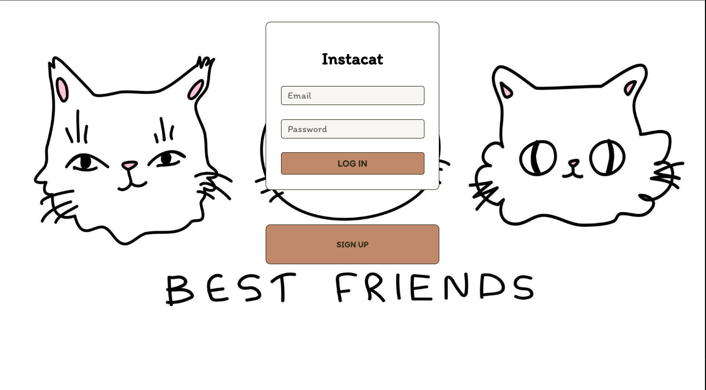
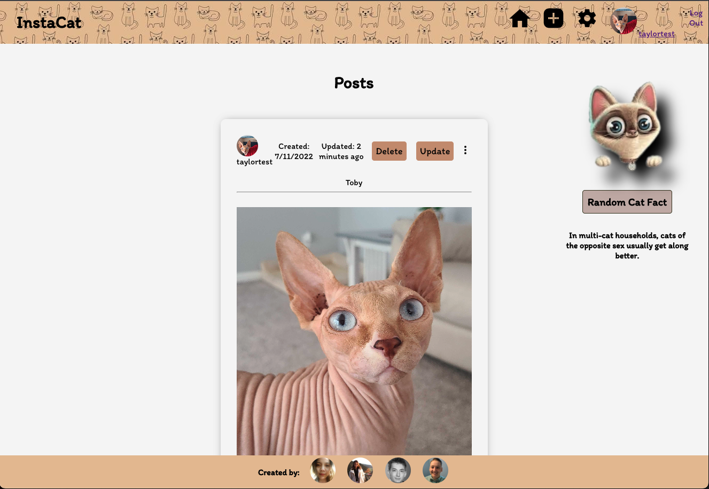
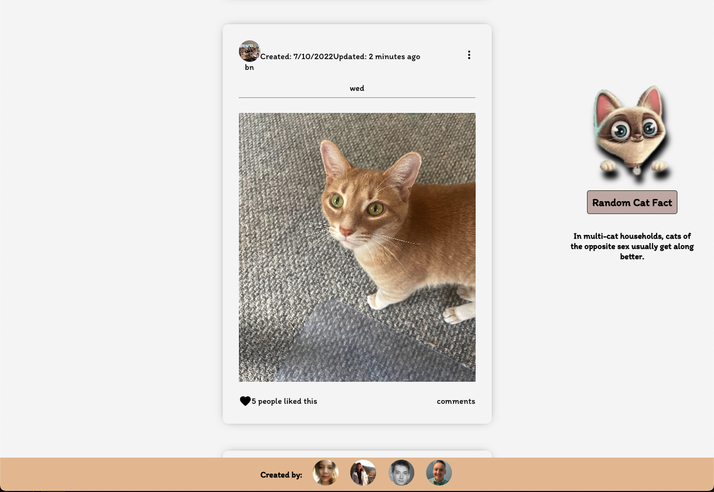

# [InstaCat](https://instacats-jat.herokuapp.com/)

Deployed Link: https://instacats-jat.herokuapp.com/

Trello Board Link: https://trello.com/b/w3k6x855/instacat

## Premise
As a user I want create cute posts of my cats and be able to share/see other peoples posts. Think instragram but we want to see pictures of your cats!

## ScreenShots

## Technologies Used
* MongoDb
* Mongoose
* Express
* React
* Nodejs
* Javascript
* CSS (Bootstrap)
* Material-ui
* HTML

## Wireframes

## ERD
